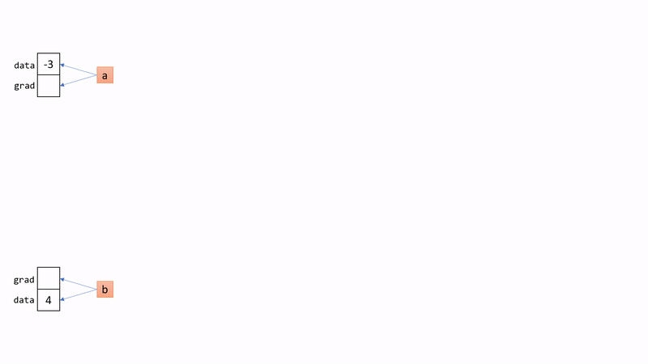
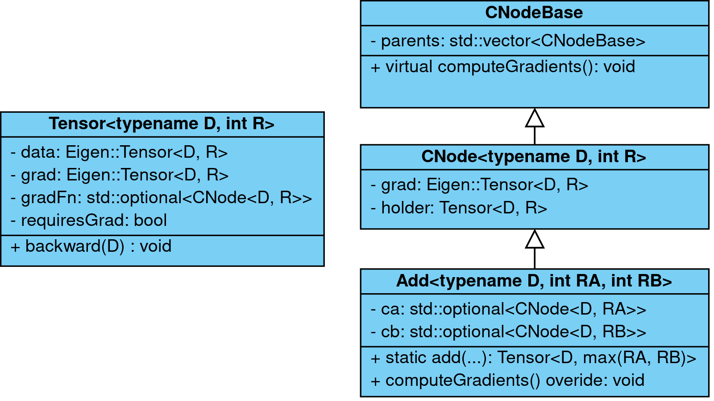

# My Super Awesome Deep Learning Library

This is a fully functioning deep learning library which was created for the practical course "Deep Learning From Scratch in C++" at Technical University of Munich. 

It includes 
 - Autograd capabilities
 - Operations such as matrix multiplications, 2D convolutions, batch norm, ReLU, cross entropy, etc. 
 - An implementation of the Adam optimizer
 - Python bindings
 - Multi core processing

However, it does not include GPU support.

## Installation
### Compile the Library
```
mkdir build
cd build
cmake ..
cmake --build . --target libdl_python --config Release
```

Note, that the compilation might take several minutes and that the library is not installed globally. 
It is copied to the folder `pylibdl/bin`.
### Dependencies  
 - Your python version should be 3.5 or higher
 - The library depends on the following packages:
   - `numpy`
   - `matplotlib`
   - `scikit-image>=0.14`
 - You can install the dependencies with `pip install -r requirements.txt`

## How it Works
The library uses a dynamic computational graph and is inspired by PyTorch. 
I. e. you don't have to define your computational graph beforehand. It is created implicitly, while you do your computations.

This is achieved with a slightly more advanced tensor class, which not only holds a reference to its data `Tensor::data`, 
but also a reference to its gradient `Tensor::grad` and a reference to the operation that created that tensor `Tensor::gradFn`.

When the `Tensor::backward()` method is called, the gradients for all predecessors are computed. 
More precisely, the gradient of the tensor calling 'backward' with respect to each predecessor is computed.

The tensor class can be found at [`src/Tensor.h`](src/Tensor.h). 
The operations such as add, conv, matmul, batch norm, ... can be found at [`src/ops/`](src/ops). 
Each operation has a static method which computes the 'forward pass' 
and a method called `computeGradients` which computes the 'backward pass', i. e. the gradients for its parents.

### A Simple Example
Let's look at the function
```
f(a, b) = a^2 + b^3
```
The derivatives towards `a` and `b` are: 
```
𝛿f/𝛿a = 2*a  
```

```math 
𝛿f/𝛿b = 3*b^2
```
If we evaluate `f` at `f(-3, 4)` 
```math 
f(2, 3) = (-3)^2 + 4^3 = 9 + 64 = 73
```
the derivatives with respect to `a` and `b` are:  
```math 
𝛿f/𝛿a = 2*(-3) = -6  
```

```math 
𝛿f/𝛿b = 3*4^2 = 48
```

Let's do these calculations in python:

```python
>>> from pylibdl import tensor
>>> import numpy as np
>>> a = tensor(np.array([-3]), requires_grad=True)  # gradFn = Leaf
>>> b = tensor(np.array([4]), requires_grad=True)  # gradFn = Leaf
>>> y = a**2 + b**3  # gradFn of y is Add<float, 1, 1>
>>> print(y.data)
[ 73 ]
>>> print(a.grad, b.grad)
None None
>>> y.backward()  # computes the gradient for all predecessors
>>> print(a.grad, b.grad)
[ -6 ] [ 48 ]
```

The animation below visualizes what happens under the hood. 


### XOR Example
 - The example below shows how this library can be used to train neural networks
 - You can look at [`pylibdl/modules.py`](pylibdl/modules.py) if you want to get a deeper understanding of how the layers/modules are implemented

```python
import numpy as np
import pylibdl as libdl
from pylibdl.modules import Module, Sequential, Linear, Sigmoid
from pylibdl.optim import Adam

# hyperparamter
hidden_units = 4
lr = 1e-2
epochs = 10000
log_every = 1000

# dataset
X = libdl.tensor(np.array([[0, 0, 1, 1], [0, 1, 0, 1]]))
y = libdl.tensor(np.array([[0, 1, 1, 0]]))

# this is the neural network
class XORClassifier(Module):
    def __init__(self):
        super().__init__()
        # one hidden layer with 'hidden_units' hidden neurons
        # after every layer we apply a sigmoid activation function
        # the first layer has two input neurons and the last layer has one output neuron
        # Sequential applies the layers in a sequential order
        self.l1 = Sequential(Linear(2, hidden_units), Sigmoid()) 
        self.l2 = Sequential(Linear(hidden_units, 1), Sigmoid())

    def forward(self, x):
        # this method does the forward pass
        # i.e. it runs 'x' through the network and returns the neworks output
        h1 = self.l1(x)
        o = self.l2(h1)
        return o

# instanciate the model
model = XORClassifier()

# use adam optimzer
optimizer = Adam(model.parameter(), lr)

print("epoch |  0^0 |  0^1 |  1^0 |  1^1 | loss")
for epoch in range(epochs):
    
    # forward pass (behind the scenes XORClassifier.forward is called)
    pred = model(X)
    
    # compute the loss between the predictions and the true labels
    # in this case mean squared error is used for simplicity
    loss = libdl.mean((pred - y)**2)
    
    # backpropagate the loss
    loss.backward()
    
    # apply and reset the gradients
    optimizer.step()
    optimizer.zero_grad()
    
    if (epoch % log_every) == 0 or epoch == (epochs - 1):
        print(f"{epoch:5d} | {pred.data[0, 0]:.2f} | {pred.data[0, 1]:.2f} | "
              f"{pred.data[0, 2]:.2f} | {pred.data[0, 3]:.2f} | {loss.data[0]:.6f}")
```

Output:

```
epoch |  0^0 |  0^1 |  1^0 |  1^1 | loss
    0 | 0.57 | 0.52 | 0.58 | 0.53 | 0.252373
 1000 | 0.05 | 0.94 | 0.95 | 0.05 | 0.002684
 2000 | 0.03 | 0.97 | 0.97 | 0.03 | 0.000779
 3000 | 0.02 | 0.98 | 0.98 | 0.02 | 0.000345
 4000 | 0.01 | 0.99 | 0.99 | 0.01 | 0.000176
 5000 | 0.01 | 0.99 | 0.99 | 0.01 | 0.000096
 6000 | 0.01 | 0.99 | 0.99 | 0.01 | 0.000055
 7000 | 0.01 | 0.99 | 0.99 | 0.01 | 0.000032
 8000 | 0.00 | 1.00 | 1.00 | 0.00 | 0.000019
 9000 | 0.00 | 1.00 | 1.00 | 0.00 | 0.000011
 9999 | 0.00 | 1.00 | 1.00 | 0.00 | 0.000007
 ```

 
### Advanced Example

For the practical course I had to realize a final project showing the library's capabilities.  
For that I trained a ResNet-like network on the [distracted driver dataset](https://www.kaggle.com/c/state-farm-distracted-driver-detection/data).
Additionally, I did an [adversarial attack](https://arxiv.org/abs/1312.6199) for some images such that the network classifies them as "save driving", regardless of their true label.

It can be found at [Final.ipynb](Final.ipynb). Some code fragments are also located at [utils.py](utils.py).  
(Sadly, the GitHub ipynb viewer does not render everything correctly i. e. if possible view it on your local jupyter server)

In order to train the model by yourself, 
download the [distracted driver dataset](https://www.kaggle.com/c/state-farm-distracted-driver-detection/data) 
and extract it into the folder `distracted_driver`.
In the end, your folder structure should look like this:
```
|-- libdl/  
|   |-- distracted_driver/  
|   |   |-- imgs/
|   |   |   |-- test/  
|   |   |   |-- train/   
|   |   |-- driver_imgs_list.csv  
|   |   |-- sample_submission.csv  
|   |-- Final.ipynb
|   |-- ...
```

## Top Level Documentation
- The library uses [Eigen](http://eigen.tuxfamily.org/) tensors
- The library can be found at [`src`](src)
   - [`src/ops`](src/ops) contains all the operations on tensors like addition, convolution, max pool, batch norm, ...
   - [`src/functional`](src/functional) contains all operations that do not require gradients such as the computations for Adam 
- The python bindings can be found in the folder [`python`](python)
- The tests can be found under [`tests`](tests)
- The slides of the final presentation can be found [here](https://tumde-my.sharepoint.com/:p:/g/personal/julius_hansjakob_tum_de/EZiiWbJhPVtFjYyqcl7SSVcBREcJFnrrrAgrX3BBRK6pOg?e=iRo2kZ)

### Code Structure
- The library contains two important classes: `Tensor<D, R>` and `CNode<D, R>`
- The image below shows a simplified class diagram
  

### The `Tensor<D, R>` Class
- *D* specifies the datatype (usually float)
- *R* specifies the number of dimensions the tensor has
- `Tensor<D, R>::data` holds the actual tensor
- `Tensor<D, R>::grad` holds the gradient of this tensor
- `Tensor<D, R>::gradFn` holds the operation that created this tensor in order to compute the gradients for its parents
- `Tensor<D, R>::requiresGrad` indicates whether the gradient for this tensor should be stored in `Tensor<D, R>::grad`
- The `Tensor<D, R>::backward()` method computes the gradient for all predecessors, that require a gradient, w. r. t. the tensor calling it
- If `Tensor<D, R>::requiresGrad` is set to *true* `Tensor<D, R>::gradFn` always contains a value. 
  In particular, this means, if no operation created this tensor, 
  then `Tensor<D, R>::gradFn` is a `Leaf<D, R>` object which just passes the gradient it receives to the tensor

### The `CNode<D, R>` Class (and its Parent `CNodeBase`)
- CNode represents a computational node in a computational graph
- `CNode<D, R>::grad` holds the gradient of this computational node which is set by its children
- The virtual method `CNodeBase::computeGradients()` computes the gradient (i. e. sets `CNode<D, R>::grad`) for all parents of this computational node. 
  Additionally, it sets `Tensor<D, R>::grad` of its holder if `Tensor<D, R>::requiresGrad` is true
- `CNode<D, R>::holder` is a weak reference to the tensor which is represented by this computational node
- Every computational operation inherits `CNode<D, R>`, which is important for the automatic differentiation
- E. g. The class `Add<D, RA, RB>` adds two Tensor's *a* and *b* (*RA* and *RB* are the number of dimensions for *a* and *b*)
   - It has a static member `Add<D, RA, RB>::add`, which takes the two tensor's as input and returns their sum in a new tensor *c*
   - If *a* or *b* (or any of its predecessors) requires a gradient to be computed, then `Tensor<D, R>::gradFn` of *c* contains an instance of `Add<D, RA, RB>`
   - The method `Add<D, RA, RB>::computeGradients()` then can compute the gradient of *a* or *b*. It also sets the `Tensor<D, R>::grad` of *c* if *c* requires a gradient
   - `Add<D, RA, RB>::ca` and `Add<D, RA, RB>::cb` contain the `Tensor<D, R>::gradFn` of the tensors *a* and *b* respectively
- `CNodeBase` is needed since the template parameters of `CNode<D, R>` are not always known

### Python Files
- Additionally to the C++ files, the library also consists of some python files located at `pylibdl`
   - `data.py` defines a `DataLoader`, with which one can easily iterate over minibatches (similar to torch.utils.data)
   - `grad.py` contains an object that allows one to disable the gradient globally using a "with" statement (similar to torch.no_grad)
   - `modules.py` wraps basic NN operations like convolution, max pool or a linear layer into python objects so they be easily used from python (similar to torch.nn.Module)
   - `optim.py` contains a class that implements Adam (similar to torch.optim.Adam)
   - `tensor.py` contains a function that converts numpy arrays to tensors of the library (similar to torch.tensor)


## Building the Tests
In order to build and run the tests, run the following commands:
```
mkdir build
cd build
cmake ..
cmake --build . --target libdl_tests
./tests/libdl_tests
```
